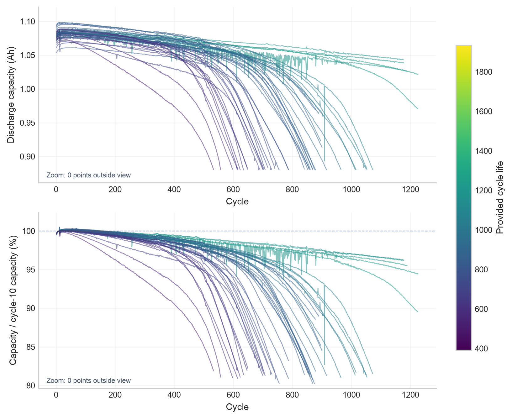
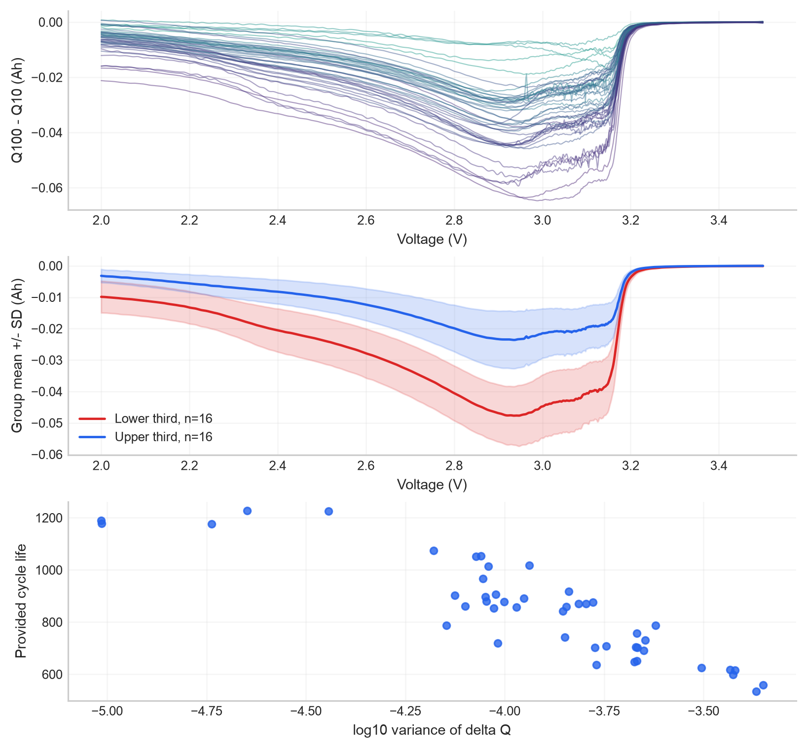
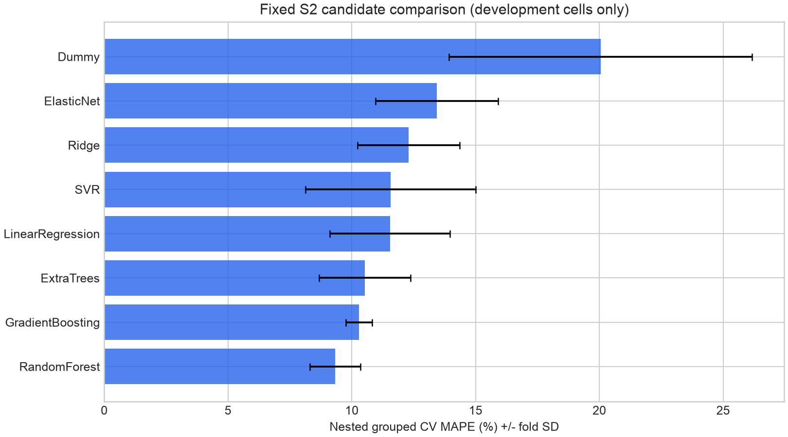
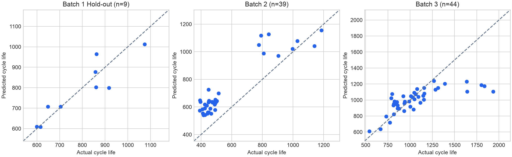
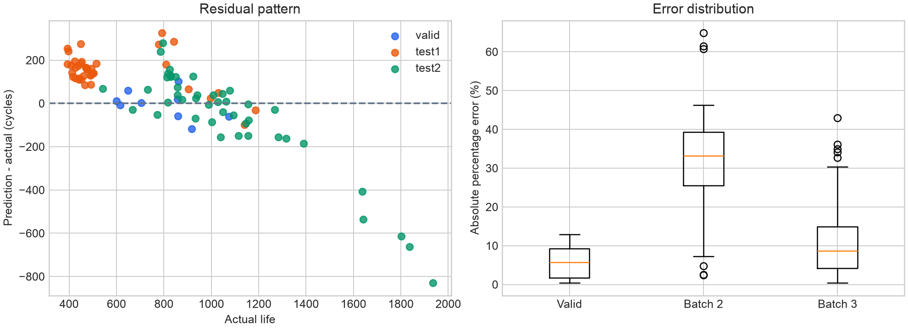

# ESS 배터리 수명 예측 — 데이터 미니 프로젝트

소속: 울산캠퍼스 · 반: 3반 · 번호: U100 · 이름: 정수민

## 목적

초기 100사이클에서 관측한 충·방전 특성으로 제공 Cycle Life를 예측한다. EDA에서 발견한 ΔQ·충전 조건·온도·저항 신호를 피처 설계로 연결하고, 여러 회귀 모델을 동일한 정책 그룹 검증 조건에서 비교한다. 실험실 셀 수명 예측의 ESS 유지보수 의사결정 지원 가능성과 현장 적용 한계를 함께 검토한다.

> 현재 결과는 **제공된 `cycle_life` 라벨에 대한 예측 실험**이다. 일부 셀의 기록이 실제 EOL까지 이어지지 않았고 원논문의 기록 연결·미완료 셀 처리도 적용하지 않아, 실제 EOL 예측 정확도를 검증한 결과로 해석하지 않는다. 최종 기준 모델은 `results/final_svr/final_model.joblib`이며, 아래 「원논문 비교 및 연구의 한계」에서 확인한 문제와 개선 계획을 설명한다.

## 프로젝트 개요

- 데이터셋: MIT-Stanford Battery Dataset (Severson et al., Nature Energy 2019)
- 학습: 과제 Batch 1 (2017-05-12) — 개발 37셀/18정책, Hold-out 9셀/5정책
- 평가: 과제 Batch 2 (2018-02-20) 39개 유효 라벨, 추가 Batch 3 (2018-04-12) 44개 유효 라벨
- 태스크: **Regression — Cycle Life 예측**. Batch 1에는 수명<500인 셀이 없어 현재 기준의 장·단수명 분류는 제외.
- 논문 메인 Batch 2(2017-06-30)와 과제 파일이 다르므로 직접 재현이라고 주장하지 않음.

## 파일 구조

```text
data/README.md, battery_modeling_ready.parquet
notebooks/01_EDA.ipynb
notebooks/02_feature_engineering.ipynb
notebooks/03_modeling.ipynb
notebooks/04_automl.ipynb, 05_optuna.ipynb, 06_final_svr.ipynb
src/preprocess.py, features.py, train.py, analyze.py
src/raw_eda.py, hypothesis_tests.py
results/model_performance.csv, performance_reporting.csv
results/cv_comparison.csv, nested_cv_folds.csv, tuning_trials.csv
results/predictions.csv, oof_predictions.csv, error_analysis.csv
results/selection.json, figures/, eda_figures/
results/automl/, optuna/, final_svr/
tests/test_pipeline.py
requirements.txt
README.md
```

## 환경 설정 및 실행

로컬 환경 파일은 `.env`, 공개 템플릿은 `.env.example`로 구분한다. 현재 필요한 값은 원시 데이터 경로 `BATTERY_DATA_DIR`뿐이며 API 키는 사용하지 않는다. 실제 `.env`는 Git 및 배포 ZIP에서 제외된다. `src.prepare`와 `src.raw_eda`는 프로젝트 `.env`를 자동으로 읽으며 기존 환경변수가 우선한다. 상세 사용법은 [GitHub 공개 업로드 규정](GITHUB_PUBLISHING.md)을 참고한다.

Python 3.12.13 / scikit-learn 1.9.1에서 실행 및 테스트했다. 프로젝트 ZIP을 풀고 아래를 실행한다.

```bash
cd ess-battery-project
python3.12 -m venv .venv
source .venv/bin/activate
pip install -r requirements.txt
python -m unittest discover -s tests -v
python -m src.train --jobs 2
python -m src.analyze
```

원본 `.mat`부터 전체 특성을 다시 만들려면 (기존 데이터 덮어쓰기를 피하려면 다른 출력 경로 지정):

```bash
python -m src.prepare --raw /원본/archive --output data/rebuilt.parquet
python -m src.train --data data/rebuilt.parquet --output results_rebuilt
```

공개 소스 저장소: [sumin-990416/ess-battery-project](https://github.com/sumin-990416/ess-battery-project). 아래 명령으로 소스를 내려받는다.

```bash
git clone https://github.com/sumin-990416/ess-battery-project.git
cd ess-battery-project
```

공개 저장소에는 데이터와 학습 모델을 포함하지 않는다. clone 후 원자료 또는 준비한 Parquet를 이용 조건에 맞게 별도로 확보해야 학습·추론을 실행할 수 있다. 데이터·모델·실행 결과를 포함한 개인용 ZIP에서는 원본 `.mat` 없이 준비된 Parquet로 모델링을 재현할 수 있다. Colab은 개인용 ZIP 업로드·압축 해제 후 노트북 안내대로 실행하고, 원본 곡선 EDA 재계산에는 `.mat`와 `BATTERY_DATA_DIR`가 필요하다.

## GitHub 공개 업로드 준비

업로드 규정·출처/라이선스·데이터 제외·비밀정보·개인정보·추적 파일 점검 절차는 [GITHUB_PUBLISHING.md](GITHUB_PUBLISHING.md)에 정리했다. GitHub용 소스 ZIP은 아래 명령으로 별도 생성한다.

```bash
python scripts/make_public_bundle.py --out dist/ess_battery_github.zip
```

개인용 재현 ZIP과 GitHub용 소스 ZIP은 다르다. 개인용에는 데이터·모델·실행 결과가 포함되고, 공개용에는 `.gitignore`·`.env.example`·코드·출력 제거 노트북과 검토 대상 집계 결과만 포함한다. 원자료·Parquet·모델·Optuna DB·셀별 예측은 기본 제외한다. 데이터 재배포 및 코드 라이선스를 아직 확정하지 않았으므로 권한 확인 전 강제 추가하지 않는다. 공개용은 데이터와 모델이 빠져 있어 clone 후 필요한 파일을 허용된 출처에서 따로 확보해야 한다. 도구의 기본 점검이 통과해도 수동 권리·개인정보 검토는 필요하다. 공개 업로드에는 개인 작업 폴더가 아니라 출력이 제거된 별도의 공개용 소스 사본을 사용한다.

## EDA

### Cycle Life 분포

| batch | n | n_label | life_min | life_median | life_max | short_lt500 | long_gt1000 |
| --- | --- | --- | --- | --- | --- | --- | --- |
| Batch 1 | 46 | 46 | 534.000 | 858.500 | 1227.000 | 0 | 10 |
| Batch 2 | 47 | 39 | 392.000 | 472.000 | 1186.000 | 28 | 3 |
| Batch 3 | 46 | 44 | 541.000 | 1005.500 | 1935.000 | 0 | 23 |

핵심 발견: Batch 2 유효 라벨의 28/39(71.8%)가 500사이클 미만이지만 Batch 1·3에는 없다. Batch 1만 잘 맞는 모델이 단수명 영역에 일반화된다고 보장할 수 없다.

### 열화 곡선

전체 사이클 용량은 대체로 감소하며 일부 후반 가속이 관찰됐다. 설정된 두 직선 모델의 knee 후보는 Batch 1: 43/46, Batch 2: 43/47, Batch 3: 45/46이다. 후보는 평활화·임계값에 민감하고 확정 물리적 전환점은 아니다. 전체 기록 길이·후반 기울기·knee는 미래 정보이므로 입력에서 제외했다.



### ΔQ(V) 분석

ΔQ(V)=Q100(V)-Q10(V), 실제 전압 격자는 2.0~3.5V의 1,000포인트다. ΔQ log 분산-수명 Spearman 상관은 Batch 1 -0.871, Batch 2 -0.709, Batch 3 -0.797로 일관된 음의 관계다. 절대 단·장수명 그룹이 없는 Batch 1·3은 하위/상위 1/3을 비교했으며 절대 장단수명과 혼동하지 않았다.



### 충전 조건 및 추가 신호

C1-수명 상관은 -0.483/+0.055/-0.229이고 초기 충전시간 중앙값-수명 상관은 +0.641/-0.812/+0.261로 batch에 따라 달랐다. 모든 batch에서 동일한 단변량 관계를 가정하지 않는다. 충전 정책은 C1·C2·전환 SOC와 함께 변하므로 인과 효과를 분리했다고 주장하지 않는다.

Batch 1 정책별 중앙값 23개로 실시한 탐색 가설 검정에서 ΔQ log 분산과 수명: ρ=-0.894, Holm p=0.00005. C2·SOC를 조정한 C1 log 수명 계수: -0.256, Holm p≈0.000026. EDA 이후 선택한 탐색 가설이며 통계적 유의성이 추가 예측 성능이나 인과성을 보장하지 않는다.

## Modeling

### 피처 엔지니어링 전략

- S1: `DQ_relative_logvar` 단독. 초기 용량 수준을 정규화하고 중복 피처를 줄임.
- S2: S1 + C1/C2/Switch_SOC. 충전 정책 조건을 포함한 공통 기본 집합.
- S3: S2 + capacity_retention_100_pct/IR_10/Tavg_median_early. 초기 용량 유지·저항·온도 신호의 추가 효용 검증.
- 상위 3개 학습 모델에서 S1/S3/속도비율 추가/원 ΔQ 분산 대체를 비교. 정규화 log 분산과 원 log 분산은 함께 투입하지 않음.
- 결측 중앙값 대체·선형/SVR 표준화는 Pipeline 안에서 학습 fold에만 fit. ID·split·label·policy 문자열은 입력 제외.
- 초기 100사이클 밖의 변수는 사용하지 않음. 수명은 log 변환하여 학습하고 exp 역변환 후 평가. Dummy는 원 수명 중앙값.

### 분할과 모델 선택

정책 기준 20% 고정 Hold-out(seed=20261001)을 먼저 분리했다. 개발 37셀/18정책에서 외부 5-fold/내부 4-fold GroupKFold로 **모델 선택 절차**를 평가했다. 각 외부 fold 내부에서 8개 S2 모델을 튜닝하고 상위 3개에 피처 집합 비교를 수행했다. 외부 검증 데이터로 재선택하지 않았다.

최종 설정은 개발 37셀의 내부 그룹 CV에서 최소 MAPE로 선정했다. 정확히 같은 점수일 때만 적은 피처·단순 모델을 우선한다. 1-SE 규칙은 이번 실행의 선택 알고리즘으로 구현하지 않았으며, 원 설계의 참고 기준과 구분한다. Hold-out·테스트 점수를 보고 후보나 피처를 변경하지 않았다. 동일한 개발 세트 학습 모델을 Valid·Batch 2·3에 적용했다.

### 후보 모델과 검증 결과

아래는 고정 S2 후보별 nested grouped-CV 평균 ± 표준편차다. SelectionProcedure는 fold마다 내부 선택 모델/피처가 달라지는 **선택 절차**의 점수다.

| model | CV_MAPE_mean | CV_MAPE_SD | n | pooled_MAPE |
| --- | --- | --- | --- | --- |
| Dummy | 20.050 | 6.116 | 37 | 20.505 |
| LinearRegression | 11.542 | 2.429 | 37 | 11.615 |
| Ridge | 12.291 | 2.063 | 37 | 12.479 |
| ElasticNet | 13.436 | 2.484 | 37 | 13.663 |
| SVR | 11.571 | 3.439 | 37 | 11.775 |
| RandomForest | 9.333 | 1.020 | 37 | 9.335 |
| ExtraTrees | 10.523 | 1.846 | 37 | 10.709 |
| GradientBoosting | 10.290 | 0.527 | 37 | 10.254 |
| SelectionProcedure | 13.489 | 2.924 | 37 | 13.549 |

**최종 모델: SVR / S1**

- 입력: `DQ_relative_logvar`
- 파라미터: RBF kernel, C=1, gamma=0.1, epsilon=0.05 (log 수명 단위).
- 개발 내부 CV MAPE: 9.204% (표준편차 1.514%). 이 값은 선택에 사용했으므로 최종 일반화 성능이 아님.
- 공통 S2 후보의 외부 CV에서는 Random Forest가 9.333%로 가장 낮았지만, 최종 SVR/S1은 **개발 내부의 피처 조합 선택 결과**다. 두 검증 값의 정의가 다르며 최종 SVR이 모든 후보보다 우월하다고 단정하지 않는다.
- 선택 절차 nested CV는 13.489%로, 단순 후보보다 반드시 개선되지 않았다. 다수 후보·피처 선택의 불안정성을 한계로 보고한다.



## 성능 결과

과제 양식의 Train은 재대입 학습 오차가 아닌 선택 절차 외부 CV 평균이다. 실제 개발 세트 재대입 MAPE는 7.370%이며 별도로 구분했다. CV 평균과 pooled OOF MAPE는 각각 13.489%, 13.549%다.

| Index | value | unit | n |
| --- | --- | --- | --- |
| Train (Batch 1 CV) | 13.489 | % | 37.000 |
| Valid (Batch 1 Hold-out) | 5.803 | % | 9.000 |
| Test (Batch 2) | 31.311 | % | 39.000 |
| Gap (Train-Valid) | -7.685 | pp | - |
| Gap (Valid-Test) | 25.508 | pp | - |
| Gap (Target-Test): Batch 2 | 22.211 | pp | - |
| Test (Batch 3) | 12.199 | % | 44.000 |
| Gap (Batch2-Batch3) | -19.112 | pp | - |
| Gap (Target-Test): Batch 3 | 3.099 | pp | - |

Gap은 뒤 단계 오차-앞 단계 오차로 정의해 양수가 성능 저하를 뜻한다. 단위는 퍼센트포인트(pp). Target-Test는 Test MAPE-9.1이다. 9.1%는 과제 제공 기준으로, 원논문과 실험 분할의 동등성이 검증되지 않았다.

### 선정 모델의 보조 지표

| split | n | MAPE | MAE | RMSE | R2 |
| --- | --- | --- | --- | --- | --- |
| valid | 9 | 5.803 | 49.003 | 63.041 | 0.826 |
| test1 | 39 | 31.311 | 155.895 | 169.650 | 0.402 |
| test2 | 44 | 12.199 | 146.993 | 235.085 | 0.426 |

### 후보별 Hold-out/Test 기술적 비교

아래 값은 최종 선택 후 산출한 기술적 비교이며 이 표를 보고 모델을 변경하지 않았다.

| model | test1 | test2 | valid |
| --- | --- | --- | --- |
| Dummy | 74.626 | 20.045 | 19.116 |
| ElasticNet | 44.988 | 14.977 | 10.463 |
| ExtraTrees | 38.981 | 15.310 | 5.564 |
| GradientBoosting | 32.625 | 16.065 | 4.995 |
| LinearRegression | 49.073 | 17.767 | 6.867 |
| RandomForest | 32.350 | 14.947 | 4.411 |
| Ridge | 46.053 | 16.470 | 7.413 |
| SVR | 44.914 | 14.017 | 8.342 |



## 오류 분석

오류를 APE와 절대 사이클 오차 양쪽으로 점검했다. APE가 가장 큰 셀은 B2_007: 실제 393 → 예측 648.0사이클, APE 64.886%다. 절대 오차가 큰 장수명 예는 B3_039: 실제 1935 → 예측 1104.7, 830.3사이클 차이. 순위가 지표에 따라 다르다.

| battery_id | split | policy | actual | predicted | APE |
| --- | --- | --- | --- | --- | --- |
| B2_007 | test1 | 3.6C(9%)-5C | 393.000 | 648.001 | 64.886 |
| B2_019 | test1 | 5.2C(50%)-4.25C | 449.000 | 724.844 | 61.435 |
| B2_016 | test1 | 3.6C(9%)-5C | 396.000 | 636.645 | 60.769 |
| B2_020 | test1 | 6C(60%)-3C | 392.000 | 573.429 | 46.283 |
| B2_003 | test1 | 5.2C(50%)-4.25C | 424.000 | 618.600 | 45.896 |

Batch 2에서 39개 중 37개를 과대 예측했고 잔차 중앙값은 +158.9사이클이다. 단수명 28개의 MAPE는 35.688%, 나머지 11개는 20.170%다. 개발 데이터에는 500 미만 label이 없어 짧은 수명 영역 학습이 부족하다는 가설과 일치한다. 원인 확정이나 인과 검증은 아니다.

Batch 2 전체 47셀 중 정규화 ΔQ 분산이 개발 범위를 벗어난 셀은 12개다. 반면 큰 오류 상위 3개는 해당 ΔQ 범위 안에 있어 단순 범위 검사만으로 문제가 설명되지 않는다. B2_007·B2_016의 전환 SOC=9%는 개발 범위 15~80% 밖이지만 최종 S1 모델은 SOC를 입력하지 않는다. 숨은 실험 조건/정책 차이가 영향을 줄 가능성으로 해석한다.

Batch 3은 수명 1935인 셀을 크게 과소 예측했다. 개발 수명 범위와 단일 초기 신호의 한계가 연결될 가능성이 있다. 이는 초기 신호만으로 최장수명을 정밀하게 예측할 수 있다는 가정을 경계하게 한다.

개선 방향: 단수명·장수명·다양한 정책을 포함한 별도 개발 데이터 확보, label/EOL 기준 확인, 정책·온도 효과가 batch를 넘어 유지되는지 검증, 교정·불확실성·OOD 감지 추가. 현재 test로 반복 튜닝하지 않고 향후 별도 학습/평가 split을 구성해야 한다.



## ESS 도메인 해석

실제 BESS에서 이 모델의 활용 후보는 수명 위험 셀/모듈의 추가 검사 우선순위, 유지보수·교체 계획 검토, 운영 조건별 열화 모니터링 지원이다. 현재 결과만으로 충전 정책의 최적값을 정하거나 안전한 운전 범위를 제어하지 않는다. 수명 회귀는 이상/화재 위험 탐지 모델이 아니다.

실험실 셀의 고속 충전 데이터와 ESS의 부분 충·방전, 긴 휴지 시간, 달력 열화, 팩 내 온도·SOC 편차는 다르다. Cycle Life는 사용 프로파일을 모르면 운용 연수나 잔여 수명(RUL)으로 직접 환산할 수 없다. 기존 label 종료 기준도 확인이 필요하다.

현장 배포를 위해 현장 SOC·전류·온도·에너지 throughput·휴지 이력, SOH/용량 측정, 팩/모듈 계층 식별과 고장/정비 이력을 확보해야 한다. 현장 조건의 EOL 정의, 시간·사이트별 외부 검증, 보정·예측구간·분포 이동 감시, 모델 버전·재학습 정책을 추가한다. 안전 관련 제어는 별도의 검증과 기존 BMS 보호 체계를 따른다.

이 해석은 현재 실험 결과에 대한 적용 가능성 제안이며 현장 효용이 검증된 결론이 아니다. NREL의 [Battery Lifespan](https://www.nrel.gov/transportation/battery-lifespan.html) 및 [계통연계 수명 모델 연구](https://research-hub.nlr.gov/en/publications/life-prediction-model-for-grid-connected-li-ion-battery-energy-st-5/)는 열·SOC·전류·달력/사이클 운용 조건 고려의 필요성을 뒷받침한다.

## 한계와 재현성

- 이전 EDA는 전체 Batch 1·2·3을 이미 보았으므로 완전 미열람 평가가 아니다.
- 독립 학습 단위는 셀 37개/정책 18개로 작다. fold SD는 엄밀한 95% 신뢰구간이 아니다.
- 제공 cycle_life label과 실제 EOL이 같은지 확인되지 않았다.
- 테스트 MAPE를 낮추기 위한 추가 튜닝을 하지 않았고 Batch 2 목표 9.1%를 달성하지 못했다.
- `final_model.joblib`는 신뢰할 수 있는 본 프로젝트 산출물만 로드한다. 다른 sklearn 버전의 로딩 호환성은 보장하지 않는다.
- 원시 데이터 재배포 조건을 확인한 후 공개 저장소에 업로드한다. 원본 `.mat`는 제외했다.

## 참고문헌

- Severson et al. (2019). Data-driven prediction of battery cycle life before capacity degradation. *Nature Energy*, 4, 383–391. [DOI](https://doi.org/10.1038/s41560-019-0356-8)
- [공식 데이터 처리 코드](https://github.com/rdbraatz/data-driven-prediction-of-battery-cycle-life-before-capacity-degradation)
- [scikit-learn Group CV](https://scikit-learn.org/stable/modules/cross_validation.html), [누수 방지](https://scikit-learn.org/stable/common_pitfalls.html)
- NREL 자료: 위 ESS 도메인 해석의 링크 참조.

## 팀 구성

- 정수민 (울산캠퍼스 3반, U100): EDA, 가설 검정, 피처 엔지니어링, 모델 비교·평가, Batch 2·3 오류 분석 및 보고서 작성.
- 다른 팀원 정보는 제공되지 않아 임의 기재하지 않았다. 분석·코드 작성 과정에 Codex를 활용했다.


## AutoML 추가 실험 (PDF 생성 제외)

FLAML 2.7.0으로 8개 모델 계열과 S1·S2·S3를 비교했다. 공식 사용법: [FLAML AutoML](https://microsoft.github.io/FLAML/docs/Use-Cases/Task-Oriented-AutoML/).

```bash
pip install -r requirements-automl.txt
python -m src.automl --seconds 20
```

선정: **scaled_svr / S1**, 내부 CV MAPE 7.537%. 모델·피처·튜닝을 반복한 5-fold 그룹 외부 CV는 **12.211% ± 1.084pp**(fold 표준편차), pooled OOF 12.295%. 내부 검색 최저 점수는 최종 일반화 성능이 아니다.

| split | Previous MAPE | AutoML MAPE | change (pp) |
| --- | ---: | ---: | ---: |
| train | 7.370 | 7.812 | 0.442 |
| valid | 5.803 | 6.220 | 0.417 |
| test1 | 31.311 | 30.323 | -0.989 |
| test2 | 12.199 | 12.148 | -0.051 |

train은 재대입 점수다. 외부 Batch 결과로 모델을 고르거나 보정하지 않았다. 기존 실험과 비교는 기술적 비교이며 통계적 유의성을 주장하지 않는다. 기존 모델은 results/final_model.joblib, 새 모델은 results/automl/final_model.joblib로 각각 보존했다. 기존 EDA에서 전체 batch를 봤으므로 외부 테스트도 완전 미열람 상태는 아니다.

각 피처 탐색은 20초/최대 160 trial이고 8개 계열을 round-robin으로 시도한다. 5개 바깥 fold 및 최종 전체 개발 탐색에서 S1·S2·S3를 다시 선택했다. 계열별 leaderboard는 내부 CV 검색 점수다. 선형/SVR 결측 대치·스케일링은 각 fold 안에서만 학습한다. log 수명을 학습하고 원 단위 MAPE로 탐색하며 저장된 LifePredictor.predict는 사이클 단위를 반환한다. 시간 제한 검색은 실행 환경에 따라 재현 결과가 달라질 수 있다.

실행된 notebooks/04_automl.ipynb, results/automl/final_leaderboard.csv, nested_cv_folds.csv, model_performance.csv, predictions.csv 및 전체 탐색 로그를 확인한다. 추가 설치 버전은 requirements-automl.txt에 고정했다. macOS는 LightGBM을 위해 libomp가 필요할 수 있다. 원시 데이터 및 PDF 보고서는 AutoML ZIP에 포함하지 않았다.

계열별 nested CV/외부 batch 비교는 results/automl/model_comparison.csv에 저장했다. CatBoost는 계열별 CV 8.630%로 가장 낮지만 Batch 2 43.443%다. Random Forest는 Batch 2 29.013%, 선정 SVR은 30.323%다. CV 점수가 좋은 것만으로 배치 간 일반화를 보장하지 않으며, 테스트 결과로 최종 모델을 교체하지 않았다. 8개 후보 모델은 results/automl/candidate_models/에 별도 보존했다.


## Optuna 개발 실험

[공식 TPE 문서](https://optuna.readthedocs.io/en/stable/reference/samplers/generated/optuna.samplers.TPESampler.html)에 따라 Optuna 5.0.0의 순차 TPE 검색을 사용했다. SVR/CatBoost/RandomForest/ExtraTrees, 6개 초기 피처 조합, log/original 타깃을 비교했다. 5개 outer fold마다 모델별 35 trial, 최종 모델별 80 trial로 총 1020 trial. 모든 trial의 4개 그룹 내부 fold를 평가하며 pruning 없음. 각 outer fold 안에서 모델·피처·타깃·파라미터를 선택했다. 이전 EDA/AutoML에서 후보를 정했으므로 전체 분석 선택 편향은 남는다.

최종 내부 CV 선정은 SVR / S2_original_DQ / log, 내부 MAPE 7.907%. 전체 선택 절차 외부 CV MAPE 12.653%. Hold-out 6.126%, Batch 2 46.681%, Batch 3 16.396%. 외부 결과로 재선정하지 않았다. train 재대입 점수는 CV 대신 쓰지 않는다. 실행한 탐색 범위와 결과·코멘트는 notebooks/05_optuna.ipynb, 모든 trial과 SQLite study는 results/optuna/에 저장했다. 기존 결과는 보존했다.

```bash
pip install -r requirements-optuna.txt
python -m src.tune_optuna --out results/optuna_new --outer-trials 35 --final-trials 80
```

6개 피처 조합은 S1/S2/S3/S2_plus_ratio/S2_original_DQ/S4_early. S4는 S3 + 초기 IR 변화, 초기 Qd 기울기, 충전시간 중앙값, 정규화 ΔQ 손실 면적이다. imputer/scaler는 각 fold 안에서만 fit한다. target log는 원 단위로 inverse transform 후 MAPE를 계산한다. 실제 최종 파라미터는 results/optuna/selection.json. 후보 모델/선정 모델 모두 별도 joblib 보존. 37개 개발 셀로 얻은 순위는 통계적 우열이나 현장 일반화를 보장하지 않는다.

이번 Optuna 후보는 이전 AutoML의 내부 CV와 선택 절차 외부 CV를 모두 개선하지 못해 기존 AutoML 모델을 유지한다. 유지 판단은 개발 데이터 점수로 했으며 테스트를 선정 기준으로 쓰지 않았다. promotion_decision.json에 보수적 실험 후 판단과 기본 추천 모델 경로를 기록했다. 추가 튜닝을 많이 한다고 성능이 좋아진다는 보장은 없다.


## 최종 모델 고정 재학습 및 결론

results/automl/selection.json의 SVR 파라미터를 그대로 고정해 개발 37셀에서 재학습했다. 입력 DQ_relative_logvar, 중앙값 대치/표준화, log 타깃/exp 복원. 파라미터 수정이나 추가 튜닝 없음. 독립 fit 두 번과 저장/재로드, 타깃 제외, 그룹 분리를 검증했다. 이전 모델 대비 최대 예측 차이는 0사이클이다.

Hold-out MAPE 6.220%, Batch 2 30.323%, Batch 3 12.148%. 고정 설정으로 다시 계산한 CV는 이미 선정에 사용된 개발 데이터라 낙관적일 수 있다. 전체 모델 선정 절차의 기존 nested CV 12.211%도 별도로 제시했다. 같은 데이터의 재실행은 새로운 독립 검증이 아니다.

현재 프로젝트의 최종 기준 모델은 results/final_svr/final_model.joblib이다. 학습 37셀만 사용했고 Hold-out 9셀을 합치지 않았다. 새 노트북 notebooks/06_final_svr.ipynb에 결과와 아래 코멘트를 분리해 저장했다. 제공된 label이 실제 EOL 80% 기준인지, 원논문 데이터 매핑/셀 포함 기준이 맞는지 미확인이다. Batch 2 성능은 아직 부족해 현장 배포 가능한 모델이라고 결론내리지 않는다.

```bash
python -m src.final_svr --out results/final_svr_new
```

Batch 2는 39셀 중 37셀을 과대 예측했고 잔차 중앙값 165.5사이클이다. 개발 단수명 영역 부족과 배치별 조건/라벨 차이는 원인 가설이며 인과 확인은 아니다. 다음 우선순위는 원본 label/EOL 및 셀 포함/연결 기준 확인과 별도 개발/평가 데이터 확보다.

## 원논문 비교 및 연구의 한계

### 1. 분석 결과 요약

본 프로젝트는 초기 100사이클의 특성을 이용하여 배터리의 제공 수명 라벨을 예측하는 회귀 모델을 개발하였다. EDA와 피처 설계를 수행한 뒤, FLAML AutoML 및 Optuna를 통해 모델 계열·피처 조합·하이퍼파라미터를 비교하였다. 최종 기준 모델로는 정규화 ΔQ 로그 분산 하나를 입력하는 RBF 커널 SVR을 유지하였다. 파라미터는 `C=9.104650856772889`, `gamma=0.023620095773267215`, `epsilon=0.08723135729496066`이며, 입력을 표준화하고 로그 수명을 학습한 뒤 원 단위로 복원하였다.

고정 설정으로 재학습한 모델은 기존 AutoML 모델과 모든 셀의 예측값이 일치하였다. 독립적인 재학습 두 회와 모델 저장·재로드 검증을 통해 현재 실행 환경에서의 재현성을 확인하였다. 다만 같은 데이터에서 결과가 재현된다는 사실은 새로운 조건에서도 정확하게 예측한다는 것을 의미하지 않는다.

| 평가 구분 | 평가 셀 수 | MAPE | MAE (사이클) | RMSE (사이클) |
| --- | ---: | ---: | ---: | ---: |
| Batch 1 Hold-out | 9 | 6.22% | 51.4 | 62.1 |
| Batch 2 | 39 | 30.32% | 151.3 | 168.0 |
| Batch 3 | 44 | 12.15% | 147.4 | 239.5 |

**해석:** Batch 1 내부 Hold-out에서는 비교적 낮은 오차를 보였지만 Batch 2에서는 성능이 크게 저하되었다. 따라서 동일 개발 배치 안에서의 예측 성능과 다른 배치에서의 일반화 성능을 구분해야 한다. 모델을 바꾸거나 탐색 범위를 확대하는 것만으로 이 차이가 해결되지는 않았다. Optuna 선정 후보는 Batch 2 MAPE 46.68%로 악화되었고, 개발 데이터의 전체 선택 절차 외부 CV도 개선하지 못하였다.

### 2. 원논문과의 실험 조건 차이

비교 대상은 Severson et al. (2019)의 *Data-driven prediction of battery cycle life before capacity degradation*이다. 원논문은 초기 100사이클의 방전 전압 곡선에서 피처를 생성하고 Elastic Net 기반 선형 모델로 로그 수명을 예측하였다. 수명은 명목 용량의 80%까지 도달하는 사이클 수로 정의하였다. [원논문 본문 및 Methods](https://web.mit.edu/braatzgroup/Severson_NatureEnergy_2019.pdf)

| 비교 항목 | 원논문 | 본 프로젝트 | 비교 시 주의점 |
| --- | --- | --- | --- |
| 원시 배치 | 2017-05-12, 2017-06-30, 2018-04-12 | 과제 기준 2017-05-12, 2018-02-20, 2018-04-12 | 두 번째 배치가 동일하지 않음 |
| 데이터 구성 | 처리 후 124개 셀 | 원시 139개 셀, 유한한 양의 라벨 129개 | 포함·제외·기록 연결 기준이 다름 |
| 학습·평가 분할 | 학습 41, Primary test 43, Secondary test 40 | 개발 37, Hold-out 9, Batch 2 평가 39, Batch 3 평가 44 | 평가 난이도와 수명 범위가 다름 |
| 핵심 피처 | 원 ΔQ(V) 로그 분산 및 확장 피처 | 초기 용량으로 정규화한 ΔQ 로그 분산 | 피처 정의가 동일하지 않음 |
| 최종 모델 | Elastic Net 기반 선형 모델 | 비선형 RBF SVR | 동일 조건에서 모델 차이만 비교한 실험이 아님 |
| 평가의 독립성 | Secondary test는 모델 개발 이후 생성 | 전체 배치를 EDA와 이전 실험에서 확인 | 완전 미열람 최종 검증이 아님 |

**해석:** 본 프로젝트는 과제에서 지정한 배치 매핑을 따르는 별도 실험이며 원논문의 엄밀한 재현 실험은 아니다. 성능 차이를 SVR과 Elastic Net의 알고리즘 차이만으로 설명할 수 없다. 과제용 분할은 유지하되, 논문 재현을 수행할 경우에는 데이터 처리와 분할을 별도로 구성해야 한다. 원논문 분할과 셀 처리는 [공식 LoadData.m](https://github.com/rdbraatz/data-driven-prediction-of-battery-cycle-life-before-capacity-degradation/blob/master/LoadData.m)에서 확인할 수 있다.

### 3. 핵심 부족점: 수명 라벨의 EOL 의미가 검증되지 않음

원논문에서 사용한 셀의 명목 용량은 1.1Ah이며, 명목 용량의 80%는 0.88Ah이다. 공식 데이터 처리 과정에는 다음 배치로 이어진 측정 기록의 연결과 미완료·문제 셀의 제외가 포함된다. 공식 Python 코드는 Batch 1 앞의 5개 셀에 다음 배치의 기록을 연결하면서 `cycle_life`도 갱신한다. [원논문 Methods](https://web.mit.edu/braatzgroup/Severson_NatureEnergy_2019.pdf), [공식 Python 처리 코드](https://github.com/rdbraatz/data-driven-prediction-of-battery-cycle-life-before-capacity-degradation/blob/master/Load%20Data.ipynb)

반면 본 프로젝트는 각 파일의 제공 `cycle_life`를 사용하였으며, 원논문의 배치 간 기록 연결을 수행하지 않았다. 원시 파일 점검 결과의 대표 예는 다음과 같다.

| 셀 | 제공 cycle_life | 기록 행 수 | 마지막 방전용량 | 기록 내 최소 양의 방전용량 |
| --- | ---: | ---: | ---: | ---: |
| B1_001 | 1,190 | 1,189 | 1.026Ah | 1.008Ah |
| B1_003 | 1,177 | 1,176 | 1.043Ah | 1.043Ah |
| B1_013 | 902 | 901 | 0.913Ah | 0.913Ah |

**해석:** 위 셀들은 확인한 기록에서 방전용량이 0.88Ah 미만으로 내려가지 않았는데 제공 라벨은 기록 행 수+1과 일치한다. 따라서 해당 값을 실제 EOL 도달 시점으로 취급할 근거가 부족하다. 측정 종료까지의 기록 길이가 실제 수명처럼 입력되었을 가능성이 있으며, 이는 모델 선택보다 먼저 해결해야 할 타깃 정의 문제이다. 유한한 양의 라벨을 보유한 129개 셀이라는 사실도 129개 모두 실제 EOL이 확인되었다는 뜻은 아니다.

추가로, 공식 코드에서 미완료로 제외하는 Batch 1의 9·11·13·14·23번 셀을 현재 프로젝트는 학습 데이터에 포함하고 있다. 앞의 5개 셀에 대한 후속 기록 연결도 적용하지 않았다. 이 차이는 학습 수명 분포와 정답 자체에 영향을 줄 수 있다. 다만 현재 폴더에는 필요한 2017-06-30 파일이 없어 실제 최종 수명으로의 갱신은 아직 수행할 수 없다.

향후 각 셀을 `EOL 관측`, `후속 측정 존재`, `측정 종료로 EOL 미관측`, `측정 오류`로 구분하는 라벨 감사표가 필요하다. EOL이 관측되지 않은 셀을 단순히 기록 길이로 확정 수명 회귀에 넣지 않고, 공식 재현에서는 정해진 제외 기준을 적용하거나 별도의 우측 검열 데이터 분석을 검토해야 한다. 생존분석은 이번에 수행하지 않은 후속 방법론이며 현재 모델의 결과가 아니다.

### 4. 성능 기준 9.1%와의 비교 한계

과제에서 제시한 9.1%는 참고 목표로 유지하되, 본 프로젝트의 Batch 2 MAPE와 동일 조건에서의 직접 비교라고 해석하지 않는다. 원논문 초록의 대표 성능과 달리 Table 1은 모델·평가셋별 오차를 나누어 제시하며, Primary test의 특정 이상 셀을 제외했을 때의 결과도 별도로 제시한다.

| 원논문 모델 | Primary test 오차 | Primary test 특정 셀 제외 시 | Secondary test 오차 |
| --- | ---: | ---: | ---: |
| Variance | 14.7% | 13.2% | 11.4% |
| Discharge | 13.0% | 10.1% | 8.6% |
| Full | 14.1% | 7.5% | 10.7% |

출처: [원논문 Table 1 및 주석](https://web.mit.edu/braatzgroup/Severson_NatureEnergy_2019.pdf). 원논문의 평균 백분율 오차는 관측 수명을 분모로 하는 절대 상대 오차 평균으로, 본 프로젝트의 MAPE와 같은 형태이다.

**해석:** 기존 성능표의 `Gap (Target-Test)`는 과제 목표 대비 수치 차이만 의미한다. 데이터·분할·셀 제외·라벨 정의가 다르므로 “원논문보다 정확도가 몇 퍼센트포인트 낮다”라는 동일 조건 비교나 알고리즘의 우열로 주장하지 않는다. 논문에서 특정 셀을 제외했다는 이유로 우리 평가에서 오류가 큰 셀을 사후 제거해서도 안 된다.

### 5. 피처 설계와 모델 비교의 부족점

본 프로젝트는 원 ΔQ 로그 분산뿐 아니라 정규화 ΔQ 분산, 충전 조건, 초기 저항·온도·용량 변화 등의 조합을 탐색하였다. 그러나 최종 선정 피처는 정규화 ΔQ 로그 분산 하나였으며, 원논문의 Variance·Discharge·Full 피처 구성을 동일하게 재현하지는 않았다. ElasticNet을 후보로 실행한 사실만으로 논문 모델을 재현했다고 볼 수 없다.

**부족한 점:** 모델 계열·피처·타깃 변환을 동시에 바꾸어 탐색했기 때문에, 어떤 변경이 일반화에 도움이 되었는지를 명확히 분리하기 어렵다. 더 많은 피처나 더 복잡한 모델이 실제 개선을 주는지 확인하는 비교도 표본 수가 작아 불확실하다.

**추가로 필요한 분석:** 동일한 처리 데이터와 분할에서 원 ΔQ 분산 선형 모델, 정규화 ΔQ 분산 선형 모델, 논문 피처 기반 Elastic Net, 동일 피처를 사용하는 SVR을 순서대로 비교한다. 모델을 고정한 피처 제거 실험과 피처를 고정한 모델 비교를 구분해 정규화·충전 조건·추가 신호의 기여를 평가해야 한다. 논문 모델링 코드는 공개 저장소의 처리 코드와 다르게 저자 요청 및 학술 라이선스 대상이므로 완전한 원 코드 재현 가능성도 확인해야 한다. [공식 저장소의 코드 이용 안내](https://github.com/rdbraatz/data-driven-prediction-of-battery-cycle-life-before-capacity-degradation)

### 6. 배치 간 일반화 및 평가의 부족점

개발 37셀의 제공 라벨 범위는 534~1,227사이클이다. 반면 Batch 2의 평가 라벨 범위는 392~1,186사이클, Batch 3은 541~1,935사이클로, 학습에 없는 단수명·장수명 영역이 존재한다. 이 분포는 현재 제공 라벨 기준이며, 라벨 정리 이후 다시 계산해야 한다.

최종 SVR은 Batch 2의 39개 중 37개를 과대 예측했고, 예측값-관측값의 중앙값은 +165.5사이클이었다. 수명 500 미만인 28개 셀의 MAPE는 34.37%였다. 예를 들어 B2_007은 제공 수명 393사이클에 대해 661.3사이클을 예측하여 APE가 68.28%였다.

**해석:** 단수명 영역의 학습 부족, 실험 조건 차이, 라벨 처리 차이는 배치 간 오차를 설명할 수 있는 원인 후보이다. 현재 결과만으로 원인별 기여를 확정하거나 충전 조건이 수명에 미치는 인과 효과를 주장할 수 없다.

본 프로젝트는 충전 정책별 그룹 분리와 fold 내부 전처리를 적용했고, 모델 선정에 Hold-out·외부 배치 점수를 직접 사용하지 않았다. 다만 전체 배치의 EDA와 여러 모델 결과를 이미 확인한 뒤 후속 실험을 설계했으므로 분석자 수준의 선택 편향은 남는다. 고정 파라미터 4-fold CV 7.54%는 선정에 사용한 데이터의 점수이며, 독립적인 최종 성능으로 제시하지 않는다. 전체 AutoML 선택 절차의 기존 nested CV 12.21%도 함께 제시하되, 이것 역시 이전 탐색 과정의 모든 편향을 제거한 것은 아니다.

향후에는 라벨과 분할을 먼저 확정하고 개발 과정에서 접근하지 않는 별도 평가 데이터를 확보해야 한다. 작은 표본에서 fold별 표준편차를 통계적 유의성이나 95% 신뢰구간으로 해석하지 않고, 반복 검증 및 정책 그룹을 고려한 불확실성 평가를 추가할 필요가 있다.

### 7. 실제 ESS 적용을 위해 추가로 필요한 것

현재 모델은 실험실 셀의 초기 신호에서 제공 총 사이클 수를 예측하는 모델이다. 실제 ESS의 운용 연수나 잔여 수명으로 바로 환산할 수 없으며, 수명 예측을 화재·안전 위험 탐지와 동일하게 취급해서도 안 된다.

현장 적용을 위해서는 운용 SOC 범위, 부분 충·방전, 전류·온도·휴지 이력, 달력 열화, 에너지 처리량, 팩·모듈 내 편차와 유지보수 이력을 추가로 확보해야 한다. 현장 EOL 기준과 셀·모듈·팩 단위의 예측 대상을 명확히 정하고, 독립 현장 검증·예측구간·분포 이탈 감지·모델 갱신 체계를 구성해야 한다. 이 항목들은 향후 적용을 위한 제안이며 이번 프로젝트에서 검증된 현장 효과가 아니다.

### 8. 개선 우선순위와 완료 기준

| 우선순위 | 개선 작업 | 필요한 자료 또는 방법 | 완료 기준 |
| --- | --- | --- | --- |
| 1 | 셀별 수명 라벨 감사 | 원시 summary, 제공 라벨, 실제 EOL 및 측정 종료 정보 | 모든 셀의 라벨 의미·검열·제외 사유를 기록 |
| 2 | 원논문 기록 연결·데이터 구성 재현 | 2017-06-30 파일과 공식 처리 코드 | 연결 셀·제외 셀·갱신 라벨·최종 셀 목록을 검증 |
| 3 | 논문 기준 모델 재현 | 논문·보충자료의 피처 정의와 정확한 분할 | 동일 데이터에서 Variance/Discharge/Full 기준 결과 확보 |
| 4 | SVR과 기준 모델의 통제된 비교 | 동일 피처·분할·평가 지표, fold 내부 전처리 | 모델 효과와 피처 효과를 분리한 비교표 작성 |
| 5 | 독립 일반화·불확실성 검증 | 별도 미열람 평가셋, 수명·정책별 잔차 분석 | 단·장수명 오차와 예측 불확실성을 독립 평가 |
| 6 | ESS 적용성 검증 | 현장 운용·열화·정비 이력과 EOL 기준 | 현장 데이터에서 활용 범위와 실패 조건 확인 |

### 9. 종합 결론

본 프로젝트의 성과는 초기 ΔQ 신호를 이용한 회귀 파이프라인, 충전 정책별 검증, AutoML·Optuna 후보 비교와 고정 모델의 재현성 확인에 있다. 그러나 일부 라벨의 실제 EOL 의미가 검증되지 않았고, 원논문의 데이터 연결·미완료 셀 처리 및 평가 분할도 재현하지 않았다. 따라서 현재 SVR은 **제공 라벨 기준의 임시 기준 모델**이며, 원논문과 동일한 실제 수명 예측 성능 또는 현장 활용 가능성이 입증된 모델로 결론내리지 않는다.

후속 개발의 우선순위는 추가 하이퍼파라미터 탐색이 아니라 **정답 라벨과 데이터 구성의 정합성 확보**이다. 이를 완료한 뒤 논문 기준 모델을 재현하고 동일 조건에서 SVR의 성능을 재평가해야 한다. 기존 실험 결과는 이 과정을 위한 기준선으로 보존한다. 본 절의 확인 사항은 문서에 반영한 것이며, 아직 원시 데이터·라벨·모델 파일을 수정하거나 재학습한 것은 아니다.
